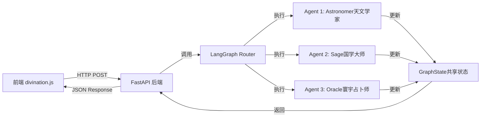

# LangGraph 多 Agent 占卜引擎实现计划

## 架构概览
本项目将构建一个基于 LangGraph 的多 Agent 系统，包含三个专业 Agent 协作完成占卜任务。系统采用前后端分离架构，Python 后端提供 API 服务，前端通过 HTTP 请求调用。



## 实现步骤

### 1. 后端项目结构搭建
创建 Python 后端目录结构：

```
backend/
├── app/
│   ├── __init__.py
│   ├── main.py                 # FastAPI 主应用
│   ├── agents/
│   │   ├── __init__.py
│   │   ├── astronomer.py       # Agent 1: 天文学家
│   │   ├── sage.py             # Agent 2: 国学大师
│   │   └── oracle.py           # Agent 3: 寰宇占卜师
│   ├── graph/
│   │   ├── __init__.py
│   │   ├── state.py            # GraphState 定义
│   │   └── workflow.py         # LangGraph 工作流
│   ├── utils/
│   │   ├── __init__.py
│   │   ├── astronomy.py        # 天文计算工具
│   │   ├── chinese_calendar.py # 中国传统历法工具
│   │   └── prompts.py          # Prompt 模板
│   └── models/
│       ├── __init__.py
│       └── schemas.py          # Pydantic 数据模型
├── requirements.txt
└── .env.example
```

### 2. 核心组件实现

#### 2.1 GraphState 定义 (backend/app/graph/state.py)
定义共享状态结构，包含：
- `user_input`: 用户输入（出生日期、问题）
- `astronomy_data`: Agent 1 输出的天文数据（JSON + 自然语言描述）
- `cultural_data`: Agent 2 输出的文化数据（八字、紫微、签文）
- `final_reading`: Agent 3 输出的最终解读（Markdown 格式）
- `current_agent`: 当前执行的 Agent
- `messages`: Agent 间的消息历史

```python
from typing import TypedDict, Optional, Dict, Any

class GraphState(TypedDict):
    user_input: Dict[str, Any]
    astronomy_data: Optional[Dict[str, Any]]
    cultural_data: Optional[Dict[str, Any]]
    final_reading: Optional[str]
    current_agent: str
    messages: list
```

#### 2.2 Agent 1: The Astronomer (backend/app/agents/astronomer.py)
功能：
- 接收 `birth_date` 和 `current_time`
- 计算太阳星座、上升星座（基于出生时间和地点模拟）
- 计算月亮盈亏（Moon Phase）
- 检测行星逆行状态（水星、金星、火星等）
- 生成 JSON 格式数据（供前端 3D 渲染）
- 生成自然语言星象描述

输出格式：
```json
{
  "retrograde": ["Mercury"],
  "moon_phase": "Waning Crescent",
  "sun_sign": "Leo",
  "rising_sign": "Scorpio",
  "visual_data": {
    "planets": [...],
    "aspects": [...]
  },
  "description": "当前水星逆行，月亮处于下弦月阶段..."
}
```

#### 2.3 Agent 2: The Sage (backend/app/agents/sage.py)
功能：
- 根据生辰计算八字属性（年柱、月柱、日柱、时柱）
- 计算紫微主星（模拟）
- 抽取灵签（Fortune Stick），包含签文诗词和解签
- 提供五行建议

输出格式：
```json
{
  "bazi": {
    "year": "甲子",
    "month": "乙丑",
    "day": "丙寅",
    "hour": "丁卯"
  },
  "ziwei_star": "紫微星",
  "fortune_stick": {
    "number": 42,
    "poem": "星河璀璨照前程，智慧如光破迷津",
    "interpretation": "此签主吉，预示...",
    "fortune_level": "上上签"
  },
  "five_elements_advice": "当前五行偏木，宜..."
}
```

#### 2.4 Agent 3: The Oracle (backend/app/agents/oracle.py)
功能：
- 读取 GraphState 中的 `astronomy_data` 和 `cultural_data`
- 结合用户的具体问题（User Query）
- 使用 CoT（思维链）技术融合东西方元素
- 生成温暖、个性化、针对性的 Markdown 格式解读

输出格式：
```markdown
# 您的专属占卜解读

虽然目前水星逆行（西方占星），但您的紫微星盘显示"红鸾星动"（东方传统），这意味着...

## 针对您的问题：事业发展

结合当前星象...
```

#### 2.5 LangGraph 工作流 (backend/app/graph/workflow.py)
构建有向图，定义 Agent 执行顺序：
- 入口节点：接收用户输入，初始化 GraphState
- Astronomer 节点：执行天文计算
- Sage 节点：执行传统文化计算
- Oracle 节点：综合解读（依赖前两个 Agent 的输出）
- 结束节点：返回最终结果

使用 LangGraph 的条件边（conditional edges）控制流程。

### 3. FastAPI 后端服务 (backend/app/main.py)
创建 REST API：
- `POST /api/divination/start`: 启动占卜流程
- `GET /api/divination/status/{session_id}`: 查询占卜状态（可选，用于异步处理）
- `POST /api/health`: 健康检查

### 4. 前端集成 (js/divination.js)
修改现有的 DivinationEngine 类：
- 将 `generateDivinationResult()` 方法改为调用后端 API
- 保持现有的 UI 交互逻辑不变
- 添加 API 调用错误处理

### 5. 依赖管理
创建 `requirements.txt`，包含：
- `langgraph`: LangGraph 框架
- `langchain`: LangChain 核心库
- `langchain-openai`: OpenAI 集成（或 `langchain-ollama` 用于本地模型）
- `fastapi`: Web 框架
- `uvicorn`: ASGI 服务器
- `pydantic`: 数据验证
- `python-dotenv`: 环境变量管理
- `ephem`: 天文计算库（可选，用于精确计算）
- `pytz`: 时区处理

### 6. 配置和环境变量
创建 `.env.example` 文件，包含：
- `OPENAI_API_KEY` 或 `OLLAMA_BASE_URL`（如果使用本地模型）
- `API_HOST`: 后端服务地址
- `API_PORT`: 后端服务端口

## 技术要点
- **LangGraph 状态管理**：使用 TypedDict 定义 GraphState，确保类型安全
- **Agent 提示词工程**：为每个 Agent 设计专业的 system prompt，明确角色定位
- **错误处理**：每个 Agent 节点都要有异常处理，避免整个流程中断
- **异步处理**：FastAPI 支持异步，LangGraph 也支持异步执行
- **数据验证**：使用 Pydantic 验证输入输出数据格式

## 文件清单
需要创建/修改的文件：

**新建文件**：
- `backend/app/main.py`
- `backend/app/graph/state.py`
- `backend/app/graph/workflow.py`
- `backend/app/agents/astronomer.py`
- `backend/app/agents/sage.py`
- `backend/app/agents/oracle.py`
- `backend/app/utils/astronomy.py`
- `backend/app/utils/chinese_calendar.py`
- `backend/app/utils/prompts.py`
- `backend/app/models/schemas.py`
- `backend/requirements.txt`
- `backend/.env.example`
- `backend/README.md`

# LangGraph 多 Agent 占卜引擎实现进展报告

## 一、项目概述
本项目基于 LangGraph 框架构建了一个多 Agent 占卜系统，融合西方占星术与中国传统命理文化，为用户提供个性化的占卜解读。系统采用前后端分离架构，后端通过 FastAPI 提供 RESTful API 服务，前端通过 HTTP 请求与后端交互。

## 二、已完成的核心功能

### 1. 后端项目结构
已创建完整的 Python 后端目录结构，确保代码组织清晰、模块化。

```
backend/
├── app/
│   ├── __init__.py
│   ├── main.py                 # FastAPI 主应用
│   ├── agents/
│   │   ├── __init__.py
│   │   ├── astronomer.py       # Agent 1: 天文学家
│   │   ├── sage.py             # Agent 2: 国学大师
│   │   └── oracle.py           # Agent 3: 寰宇占卜师
│   ├── graph/
│   │   ├── __init__.py
│   │   ├── state.py            # GraphState 定义
│   │   └── workflow.py         # LangGraph 工作流
│   ├── utils/
│   │   ├── __init__.py
│   │   ├── astronomy.py        # 天文计算工具
│   │   ├── chinese_calendar.py # 中国传统历法工具
│   │   └── prompts.py          # Prompt 模板
│   └── models/
│       ├── __init__.py
│       └── schemas.py          # Pydantic 数据模型
├── requirements.txt
└── .env.example
```

### 2. GraphState 定义
已在 `backend/app/graph/state.py` 中定义了 LangGraph 工作流的共享状态结构，确保数据在 Agent 间的安全传递和类型检查。

```python
from typing import TypedDict, Optional, Dict, Any

class GraphState(TypedDict):
    user_input: Dict[str, Any]
    astronomy_data: Optional[Dict[str, Any]]
    cultural_data: Optional[Dict[str, Any]]
    final_reading: Optional[str]
    current_agent: str
    messages: list
```

### 3. 三个 Agent 实现

#### 3.1 Astronomer (天文学家)
- 功能：计算天文数据（星座、月相、行星逆行等）
- 输出：包含太阳星座、上升星座、月亮盈亏、行星逆行状态的 JSON 数据及自然语言描述
- 路径：`backend/app/agents/astronomer.py`

#### 3.2 Sage (国学大师)
- 功能：计算传统文化数据（八字、紫微、签文等）
- 输出：包含八字属性、紫微主星、灵签及五行建议的 JSON 数据
- 路径：`backend/app/agents/sage.py`

#### 3.3 Oracle (寰宇占卜师)
- 功能：综合解读生成，融合东西方元素
- 输出：Markdown 格式的个性化占卜解读
- 路径：`backend/app/agents/oracle.py`

### 4. LangGraph 工作流
已在 `backend/app/graph/workflow.py` 中构建了线性工作流，管理 Agent 执行顺序：
- 入口节点：接收用户输入，初始化 GraphState
- Astronomer 节点：执行天文计算
- Sage 节点：执行传统文化计算
- Oracle 节点：综合解读（依赖前两个 Agent 的输出）
- 结束节点：返回最终结果

### 5. FastAPI 后端服务
已在 `backend/app/main.py` 中实现了 REST API 端点：
- `POST /api/divination/start`: 启动占卜流程
- `GET /api/divination/status/{session_id}`: 查询占卜状态（可选，用于异步处理）
- `POST /api/health`: 健康检查

### 6. 工具函数
已实现以下工具函数：
- 天文计算工具：`backend/app/utils/astronomy.py`
- 中国传统历法工具：`backend/app/utils/chinese_calendar.py`
- Prompt 模板：`backend/app/utils/prompts.py`

### 7. 前端集成
已修改 `js/divination.js`，集成后端 API 调用：
- 将 `generateDivinationResult()` 方法改为调用后端 API
- 保持现有的 UI 交互逻辑不变
- 添加 API 调用错误处理

### 8. 依赖和配置
已创建所有必要的配置文件：
- `requirements.txt`: 项目依赖列表
- `.env.example`: 环境变量示例
- `backend/README.md`: 项目文档（Markdown 格式）

## 三、下一步计划

### 1. 测试与优化
- 对每个 Agent 进行单元测试，确保功能正确性
- 对整个工作流进行集成测试，确保 Agent 间协作顺畅
- 优化性能，减少 API 响应时间

### 2. 功能扩展
- 添加更多占卜类型（如塔罗牌、占星骰子等）
- 实现用户认证和个性化设置
- 添加历史记录功能，方便用户查看过往占卜结果

### 3. 部署与上线
- 配置生产环境，部署后端服务
- 优化前端性能，提升用户体验
- 监控系统运行状态，及时处理异常

## 四、总结
本项目已完成核心功能的开发，包括后端项目结构搭建、GraphState 定义、三个 Agent 实现、LangGraph 工作流构建、FastAPI 后端服务实现、工具函数开发、前端集成以及依赖和配置文件创建。下一步将重点进行测试与优化、功能扩展以及部署与上线工作，确保系统稳定运行并提供良好的用户体验。
